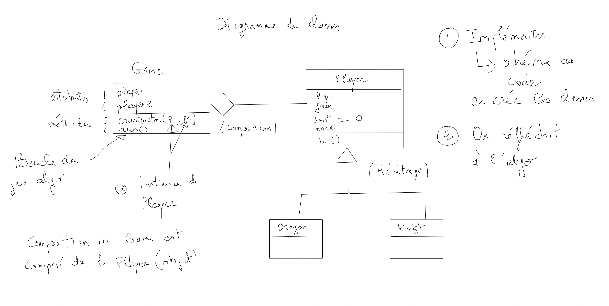

# 04 sujet Dragon & Knight

Créez les classes suivantes : Dragon et Knight qui héritent de la classe **Player** ainsi qu'une classe Game qui implémentera la logique du jeu.

Dans un seul et même fichier un dragon et un chevalier s'affrontent en se portant des coups de manière aléatoire. La classe Game est composée de deux objets Dragon et Knight de type Player.

Lorsqu'un des deux adversaire n'a plus de vie la partie est terminée et le vainqueur est celui qui possède encore de la vie. 

Les classe Dragon et Knight auront les propriétés et méthodes suivantes :

**Attributs**

- force <- number

- life  <- number

- shot  <- statistique sur le nombre de coups portés 

- name  <- string

**Méthodes**

- hit()  <- retirer de la vie de manière aléatoire dans le combat

La classe **Game** aura les attributs et méthode suivantes :

- players : les deux joueurs Dragon & Knigth 

- run() <- méthode qui lancera le jeu (boucle de jeu)

Indications : voici un schéma pour vous aidez à implémenter le code :

